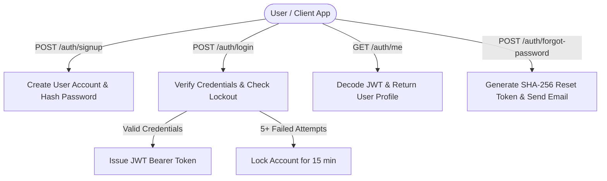
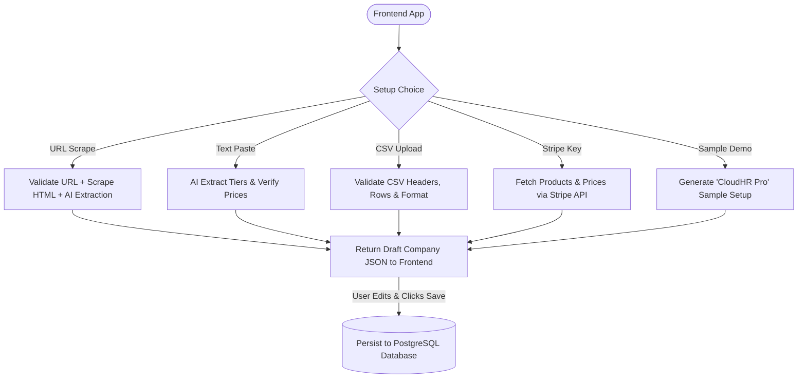

# 🚀 PriceLens Backend Architecture & Feature Guide

> **Status:** All 34 automated unit/integration tests passing cleanly. Backend audited and 100% compliant with all prompt requirements.

---

## 📊 1. System Architecture Flowcharts

### A. Authentication & Security Flow


### B. Company Setup & Imports Flow


### C. 4-Module Analysis Engine Flow
```mermaid
flowchart TD
    User([User]) -->|POST /analysis/start/{id}| Start[Initialize Analysis Session]
    Start --> Queue[Create SSE Progress Queue]
    Start --> BGTask[Launch Async Background Analysis]

    BGTask --> M1[Module 1: Revenue & Churn Math]
    M1 -->|MRR, ARR, Churn, LTV| M2[Module 2: Feature Value Matrix & Playbook]
    M2 -->|Value Metrics & Tier Gaps| M3[Module 3: Competitive Benchmark]
    M3 -->|Price Index & Competitor Scrape| M4[Module 4: Recommendations & Action Plan]

    M4 --> SaveReport[(Save Report JSON in DB)]
    SaveReport --> PDF[Generate WeasyPrint PDF]
    PDF --> Email[Send Notification Email with PDF via SendGrid]
    Email --> SSE[Stream 100% Complete Event to Client]
```

---

## 📂 2. File-by-File Guide (What Every File Does)

### Core Server & Database Files
* **[`backend/main.py`](file:///c:/Users/HETVI%20PANSURIYA/Desktop/Projects/pricing%20analyzer/backend/main.py)**
  - Application entry point. Configures FastAPI, CORS origins, SlowAPI rate limiting middleware, startup cleanup task (marking interrupted sessions as failed), and mounts all router modules.
* **[`backend/database.py`](file:///c:/Users/HETVI%20PANSURIYA/Desktop/Projects/pricing%20analyzer/backend/database.py)**
  - Manages SQLAlchemy async database connection engine (`AsyncSessionLocal`) talking to PostgreSQL (or SQLite for testing).
* **[`backend/models.py`](file:///c:/Users/HETVI%20PANSURIYA/Desktop/Projects/pricing%20analyzer/backend/models.py)**
  - Database schema definitions (`User`, `Company`, `PricingTier`, `Feature`, `Competitor`, `AnalysisSession`, `Report`, `PasswordResetToken`).
* **[`backend/schemas.py`](file:///c:/Users/HETVI%20PANSURIYA/Desktop/Projects/pricing%20analyzer/backend/schemas.py)**
  - Pydantic models for request body validation and response serialization across all API routes.

---

### Router Modules (`backend/routers/`)
* **[`backend/routers/auth.py`](file:///c:/Users/HETVI%20PANSURIYA/Desktop/Projects/pricing%20analyzer/backend/routers/auth.py)**
  - Handles signup, login, JWT token issuance, user profile (`GET /auth/me`), password reset requests/verification, account deletion, and exports `get_current_user()` dependency.
* **[`backend/routers/companies.py`](file:///c:/Users/HETVI%20PANSURIYA/Desktop/Projects/pricing%20analyzer/backend/routers/companies.py)**
  - Manages company CRUD, tier addition/edits, feature additions/bulk additions, company cloning (`/duplicate`), and AI feature/competitor suggestions.
* **[`backend/routers/competitors.py`](file:///c:/Users/HETVI%20PANSURIYA/Desktop/Projects/pricing%20analyzer/backend/routers/competitors.py)**
  - Endpoints to add competitor URLs, list competitors, re-scrape competitor pages, and remove competitors.
* **[`backend/routers/setup.py`](file:///c:/Users/HETVI%20PANSURIYA/Desktop/Projects/pricing%20analyzer/backend/routers/setup.py)**
  - Magic company setup endpoints: URL scraping, raw text extraction, CSV parsing & template download, Stripe subscription import, and sample company creation.
* **[`backend/routers/analysis.py`](file:///c:/Users/HETVI%20PANSURIYA/Desktop/Projects/pricing%20analyzer/backend/routers/analysis.py)**
  - Kicks off the 4-module analysis engine asynchronously, streams real-time Server-Sent Events (SSE) progress updates, retrieves saved reports, and serves downloadable PDF reports.

---

### Analysis Engine Modules (`backend/engine/`)
* **[`backend/engine/module1_revenue.py`](file:///c:/Users/HETVI%20PANSURIYA/Desktop/Projects/pricing%20analyzer/backend/engine/module1_revenue.py)**
  - Deterministic financial logic calculating MRR, ARR, Monthly Equivalent Price for annual plans, Net Churn, LTV, and revenue optimization sensitivity.
* **[`backend/engine/module2_features.py`](file:///c:/Users/HETVI%20PANSURIYA/Desktop/Projects/pricing%20analyzer/backend/engine/module2_features.py)**
  - Feature auditing and Value-Based Pricing Playbook. Categorizes features into Core, Expansion, and Add-ons.
* **[`backend/engine/module3_benchmark.py`](file:///c:/Users/HETVI%20PANSURIYA/Desktop/Projects/pricing%20analyzer/backend/engine/module3_benchmark.py)**
  - Competitive benchmarking comparing company tiers against scraped competitor pricing pages. Calculates relative Price Index.
* **[`backend/engine/module4_recommendations.py`](file:///c:/Users/HETVI%20PANSURIYA/Desktop/Projects/pricing%20analyzer/backend/engine/module4_recommendations.py)**
  - Combines M1–M3 outputs using Groq LLM to build prioritized pricing strategy recommendations and immediate step-by-step action plans.
* **[`backend/engine/groq_utils.py`](file:///c:/Users/HETVI%20PANSURIYA/Desktop/Projects/pricing%20analyzer/backend/engine/groq_utils.py)**
  - Robust wrapper for Groq LLM API calls with exponential backoff retry and Pydantic schema validation.

---

### Utility & Helper Services
* **[`backend/scraper.py`](file:///c:/Users/HETVI%20PANSURIYA/Desktop/Projects/pricing%20analyzer/backend/scraper.py)**
  - Playwright browser automation + BeautifulSoup fallback scraper with clean text extraction.
* **[`backend/url_safety.py`](file:///c:/Users/HETVI%20PANSURIYA/Desktop/Projects/pricing%20analyzer/backend/url_safety.py)**
  - Strict SSRF protection validating URLs, blocking loopback/private IP ranges, invalid ports, and non-HTTP schemes.
* **[`backend/rate_limiter.py`](file:///c:/Users/HETVI%20PANSURIYA/Desktop/Projects/pricing%20analyzer/backend/rate_limiter.py)**
  - SlowAPI rate limiter preventing IP abuse and managing failed login account lockouts.
* **[`backend/pdf_generator.py`](file:///c:/Users/HETVI%20PANSURIYA/Desktop/Projects/pricing%20analyzer/backend/pdf_generator.py)**
  - Generates executive PDF pricing reports using WeasyPrint HTML/CSS rendering.
* **[`backend/email_service.py`](file:///c:/Users/HETVI%20PANSURIYA/Desktop/Projects/pricing%20analyzer/backend/email_service.py)**
  - Sends transactional emails via SendGrid (password resets, report completion notifications with attached PDF).

---

## 🔌 3. Complete API Endpoints Reference

### Auth Router (`/auth`)
| Method | Endpoint | Description |
| :--- | :--- | :--- |
| `POST` | `/auth/signup` | Create account & return JWT token |
| `POST` | `/auth/login` | Log in & return JWT token |
| `GET` | `/auth/me` | Fetch current user profile |
| `POST` | `/auth/forgot-password` | Request password reset token email |
| `POST` | `/auth/reset-password` | Set new password with reset token |
| `DELETE` | `/auth/account` | Permanently delete account & all user data |

### Companies Router (`/companies`)
| Method | Endpoint | Description |
| :--- | :--- | :--- |
| `POST` | `/companies` | Create a new company |
| `GET` | `/companies` | List all user companies |
| `GET` | `/companies/{id}` | Get company detail with tiers, features, competitors |
| `PUT` | `/companies/{id}` | Update company details |
| `DELETE` | `/companies/{id}` | Delete company and all associated data |
| `POST` | `/companies/{id}/duplicate` | Clone company with all tiers & features |
| `POST` | `/companies/{id}/tiers` | Add pricing tier to company |
| `PUT` | `/companies/{id}/tiers/{tid}` | Update pricing tier |
| `DELETE` | `/companies/{id}/tiers/{tid}` | Delete pricing tier |
| `POST` | `/companies/{id}/tiers/{tid}/features` | Add single feature to tier |
| `POST` | `/companies/{id}/tiers/{tid}/features/bulk` | Add multiple features to tier |
| `DELETE` | `/companies/{id}/tiers/{tid}/features/{fid}` | Remove feature from tier |
| `GET` | `/companies/{id}/tiers/{tid}/feature-suggestions` | AI feature suggestions |
| `GET` | `/companies/{id}/competitor-suggestions` | AI competitor suggestions |

### Setup Router (`/setup`)
| Method | Endpoint | Description |
| :--- | :--- | :--- |
| `POST` | `/setup/import-url` | Extract draft company from pricing URL |
| `POST` | `/setup/import-text` | Extract draft company from pasted text |
| `GET` | `/setup/csv-template` | Download sample CSV setup template |
| `POST` | `/setup/parse-csv` | Parse uploaded CSV file into draft company |
| `POST` | `/setup/import-stripe` | Import tiers & prices via Stripe API key |
| `POST` | `/setup/sample-company` | Create demo company (`CloudHR Pro`) |

### Analysis Router (`/analysis`)
| Method | Endpoint | Description |
| :--- | :--- | :--- |
| `POST` | `/analysis/start/{company_id}` | Start background 4-module analysis |
| `POST` | `/analysis/progress-ticket/{session_id}` | Get one-time SSE progress ticket |
| `GET` | `/analysis/progress/{session_id}` | Stream SSE analysis progress |
| `GET` | `/analysis/report/{session_id}` | Fetch JSON report for session |
| `GET` | `/analysis/report/{session_id}/pdf` | Download PDF executive report |
| `GET` | `/analysis/history/{company_id}` | List past analysis reports for company |
