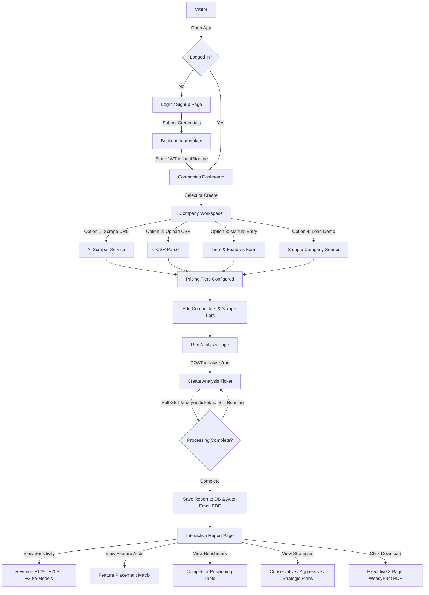
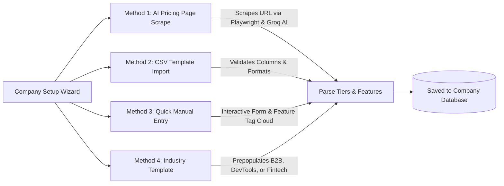
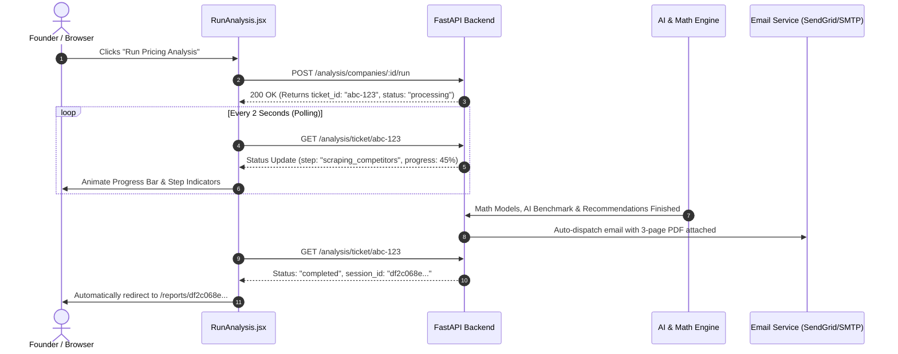

# 🎨 PriceLens — Frontend Architecture & End-to-End Flow Guide

> **A beginner-friendly, visual guide to the PriceLens React application.**  
> Learn how pages communicate, how state is managed, what key pricing terms mean, and how data moves from user clicks all the way to backend AI services.

---

## 📑 Table of Contents
1. [Tech Stack & High-Level Philosophy](#1-tech-stack--high-level-philosophy)
2. [End-to-End System Flowchart](#2-end-to-end-system-flowchart)
3. [Page Directory & Route Map](#3-page-directory--route-map)
4. [Step-by-Step User Journeys](#4-step-by-step-user-journeys)
   - [A. Authentication & Security Flow](#a-authentication--security-flow)
   - [B. Multi-Company Workspace Management](#b-multi-company-workspace-management)
   - [C. 4-Way Tier Setup (Manual, CSV, AI Scrape, Sample Data)](#c-4-way-tier-setup-manual-csv-ai-scrape-sample-data)
   - [D. Competitor Benchmarking Flow](#d-competitor-benchmarking-flow)
   - [E. Analysis Pipeline & Ticket Polling](#e-analysis-pipeline--ticket-polling)
   - [F. Interactive 4-Module Pricing Report](#f-interactive-4-module-pricing-report)
5. [Dictionary: Plain English Terms & Concepts](#5-dictionary-plain-english-terms--concepts)
6. [API Client & Function Breakdown](#6-api-client--function-breakdown)
7. [Design System & Vanilla CSS Architecture](#7-design-system--vanilla-css-architecture)

---

## 1. Tech Stack & High-Level Philosophy

The PriceLens frontend is designed to feel like a **modern, warm editorial financial software** (inspired by Stripe Press, Linear, and Notion), avoiding generic AI templates or bulky frameworks.

| Layer | Technology | Why We Use It |
|---|---|---|
| **Core Framework** | **React 18** | Declarative UI, state management, component modularity. |
| **Build Tool & Bundler** | **Vite** | Instant Hot Module Replacement (HMR) and ultra-fast builds (~250ms). |
| **Styling** | **Vanilla CSS** | 100% full design control with CSS variables; zero runtime CSS bloat or Tailwind overhead. |
| **Routing** | **React Router v6** | Client-side routing with nested layout routes and auth protection. |
| **HTTP Client** | **Axios** | Centralized client with automatic JWT token attachment and 401 redirect interceptors. |
| **Icons & Visuals** | **Custom Inline SVGs** | Zero external heavy icon font packages; crisp rendering on retina displays. |

---

## 2. End-to-End System Flowchart

Here is how a user moves through PriceLens from first landing to viewing their full pricing report:



---

## 3. Page Directory & Route Map

All routing is defined in [`frontend/src/App.jsx`](file:///c:/Users/HETVI%20PANSURIYA/Desktop/Projects/pricing%20analyzer/frontend/src/App.jsx).

```
frontend/src/pages/
├── Login.jsx                 -> Route: /login
├── Signup.jsx                -> Route: /signup
├── ForgotPassword.jsx        -> Route: /forgot-password
├── ResetPassword.jsx         -> Route: /reset-password
│
├── [AppLayout Wrapper]       -> Persistent Sidebar + Header for all authenticated routes
│   ├── Companies.jsx         -> Route: /companies (Workspace switcher & company management)
│   ├── CompanySetup.jsx      -> Route: /companies/:id/setup (4-method onboarding wizard)
│   ├── PricingTiers.jsx      -> Route: /companies/:id/tiers (Manage tiers, prices, features)
│   ├── Competitors.jsx       -> Route: /companies/:id/competitors (Competitor URLs & scraper)
│   ├── RunAnalysis.jsx       -> Route: /companies/:id/analyze (Start analysis & live progress)
│   ├── CompanyReports.jsx    -> Route: /companies/:id/reports (Company-specific report history)
│   ├── Report.jsx            -> Route: /reports/:sessionId (Live 4-module interactive report)
│   └── AnalysisHistory.jsx   -> Route: /history (Global audit log of all completed runs)
```

---

## 4. Step-by-Step User Journeys

### A. Authentication & Security Flow
- **Files:** [`Login.jsx`](file:///c:/Users/HETVI%20PANSURIYA/Desktop/Projects/pricing%20analyzer/frontend/src/pages/Login.jsx), [`Signup.jsx`](file:///c:/Users/HETVI%20PANSURIYA/Desktop/Projects/pricing%20analyzer/frontend/src/pages/Signup.jsx), [`AuthContext.jsx`](file:///c:/Users/HETVI%20PANSURIYA/Desktop/Projects/pricing%20analyzer/frontend/src/context/AuthContext.jsx)
- **Visual Design:** Split layout with the **Value Proposition preview card on the left** and the **authentication form on the right**.
- **Security Logic:**
  1. The user inputs their email and password.
  2. The frontend sends credentials to `POST /auth/token` (or `/auth/signup`).
  3. The returned JWT Bearer token is safely stored in `localStorage.getItem('token')`.
  4. The user is redirected to the `/companies` workspace dashboard.
  5. If an unauthorized (`401`) response is encountered on any subsequent API call, [`client.js`](file:///c:/Users/HETVI%20PANSURIYA/Desktop/Projects/pricing%20analyzer/frontend/src/api/client.js) automatically clears the stored token and navigates back to `/login`.

---

### B. Multi-Company Workspace Management
- **File:** [`Companies.jsx`](file:///c:/Users/HETVI%20PANSURIYA/Desktop/Projects/pricing%20analyzer/frontend/src/pages/Companies.jsx)
- **Features:**
  - **Company Cards:** Displays MRR, number of active tiers, and number of saved competitors for each company.
  - **Duplicate Company:** Duplicate any company structure with one click to simulate "What-If" pricing experiments without touching production data.
  - **Sample Company One-Click Seeder:** Instant button to load **"CloudHR Pro"** preloaded with realistic B2B SaaS tiers and competitors for instant testing.

---

### C. 4-Way Tier Setup (Manual, CSV, AI Scrape, Sample Data)
- **File:** [`CompanySetup.jsx`](file:///c:/Users/HETVI%20PANSURIYA/Desktop/Projects/pricing%20analyzer/frontend/src/pages/CompanySetup.jsx)
- Users can import their pricing tiers using 4 flexible methods:



---

### D. Competitor Benchmarking Flow
- **File:** [`Competitors.jsx`](file:///c:/Users/HETVI%20PANSURIYA/Desktop/Projects/pricing%20analyzer/frontend/src/pages/Competitors.jsx)
- **How it works:**
  1. **Add Competitor:** Enter the competitor name and website URL.
  2. **Automatic Page Scraping:** When saved, the system calls `POST /competitors/:id/scrape` to fetch the competitor's live pricing page text.
  3. **Industry Suggested Competitors:** Clickable suggestion chips (e.g., BambooHR, Gusto, Rippling for HR Tech; Datadog, New Relic for DevOps) so founders don't have to search manually.

---

### E. Analysis Pipeline & Ticket Polling
- **File:** [`RunAnalysis.jsx`](file:///c:/Users/HETVI%20PANSURIYA/Desktop/Projects/pricing%20analyzer/frontend/src/pages/RunAnalysis.jsx)
- Because pricing modeling and competitor AI benchmarking require ~20–35 seconds, PriceLens uses an **asynchronous ticket system** so the browser UI never freezes or times out:



---

### F. Interactive 4-Module Pricing Report
- **File:** [`Report.jsx`](file:///c:/Users/HETVI%20PANSURIYA/Desktop/Projects/pricing%20analyzer/frontend/src/pages/Report.jsx)
- The completed report provides four comprehensive analysis modules:
  1. **Revenue Sensitivity Modeling:**
     - Pure mathematical elasticity curve projecting revenue changes at **+10%**, **+20%**, and **+30%** price increases.
     - Compares Current MRR vs. Projected MRR and Net Gain after predicted churn.
  2. **Feature Tier Audit Matrix:**
     - AI classifies every feature into strategic buckets: **Gatekeeper**, **Blocker**, **Right-Placed**, or **Undifferentiated**.
     - Provides clear warnings if enterprise features are being given away in cheap tiers.
  3. **Competitor Benchmarking Table:**
     - Side-by-side pricing tier comparisons against scraped competitor data.
     - Relative market positioning assessment (Budget, Mid-Market, Premium).
  4. **Ranked Alternative Strategies:**
     - 3 actionable plans: **Conservative** (safe price bump), **Aggressive** (maximum yield), and **Strategic** (feature packaging restructure).
  5. **Executive PDF Export:**
     - Instant button: **"Download PDF Report"** fetching the exact 3-page WeasyPrint executive summary.

---

## 5. Dictionary: Plain English Terms & Concepts

| Term | What It Means in Simple Words |
|---|---|
| **MRR (Monthly Recurring Revenue)** | The total predictable revenue your company earns every single month from active subscriptions. |
| **ARR (Annual Recurring Revenue)** | `MRR × 12`. The yearly value of your subscription contracts. |
| **Price Elasticity** | How sensitive your customers are to price changes. If elasticity is high, small price hikes cause large cancellations. If elasticity is low, you can safely raise prices without losing customers. |
| **Churn Rate** | The percentage of customers who cancel their subscription each month (e.g., 3% churn means 3 out of 100 users cancel per month). |
| **Gatekeeper Feature** | A high-value feature (like SSO or Custom Roles) that enterprise buyers *must* have to purchase. Giving this away in a cheap tier hurts revenue. |
| **Blocker Feature** | A feature that users complain is locked behind too high a tier, preventing them from adopting your product. |
| **Right-Placed Feature** | A feature sitting in the exact right pricing tier for its target audience. |
| **Ticket / Polling** | A pattern where the frontend asks the server: *"Are you done yet?"* every 2 seconds until a long-running AI job finishes, instead of holding a single fragile network connection open. |
| **Bearer Token** | A secure digital passport (JWT) passed in the `Authorization: Bearer <token>` header of every HTTP request to verify who you are. |

---

## 6. API Client & Function Breakdown

All backend communication is centralized in `frontend/src/api/`:

### [`client.js`](file:///c:/Users/HETVI%20PANSURIYA/Desktop/Projects/pricing%20analyzer/frontend/src/api/client.js) — The Central Axios Hub
- **`apiClient`**: Pre-configured Axios instance using `import.meta.env.VITE_API_URL || 'http://localhost:8000'`.
- **Request Interceptor**: Automatically pulls the JWT token from `localStorage` and attaches `headers.Authorization = 'Bearer ' + token`.
- **Response Interceptor**: Automatically catches `401 Unauthorized` responses, clears invalid tokens, and redirects the browser to `/login`.

### Key API Modules
- [`analysis.js`](file:///c:/Users/HETVI%20PANSURIYA/Desktop/Projects/pricing%20analyzer/frontend/src/api/analysis.js):
  - `startAnalysis(companyId)`: Dispatches the asynchronous analysis job.
  - `getAnalysisTicket(ticketId)`: Checks live job progress (0–100%).
  - `getAnalysisReport(sessionId)`: Retrieves the completed 4-module report.
  - `downloadReportPdf(sessionId)`: Triggers direct binary PDF download.
- [`companies.js`](file:///c:/Users/HETVI%20PANSURIYA/Desktop/Projects/pricing%20analyzer/frontend/src/api/companies.js):
  - `getCompanies()`: Lists all companies for the current user.
  - `createCompany(data)`: Creates a new company record.
  - `duplicateCompany(id)`: Clones a company and all its tiers for testing.
  - `deleteCompany(id)`: Removes a company workspace.
- [`setup.js`](file:///c:/Users/HETVI%20PANSURIYA/Desktop/Projects/pricing%20analyzer/frontend/src/api/setup.js):
  - `extractFromUrl(companyId, url)`: Sends URL to backend AI scraper.
  - `uploadCsv(companyId, file)`: Uploads and parses pricing CSV.
  - `downloadCsvTemplate()`: Downloads `pricelens_tiers_template.csv`.
  - `createSampleCompany()`: Creates the "CloudHR Pro" instant demo company.
- [`tiers.js`](file:///c:/Users/HETVI%20PANSURIYA/Desktop/Projects/pricing%20analyzer/frontend/src/api/tiers.js):
  - `getTiers(companyId)`: Fetches tiers with features and user counts.
  - `saveTier(companyId, tierData)`: Creates or updates a pricing tier.
  - `deleteTier(companyId, tierId)`: Deletes an obsolete tier.
- [`competitors.js`](file:///c:/Users/HETVI%20PANSURIYA/Desktop/Projects/pricing%20analyzer/frontend/src/api/competitors.js):
  - `getCompetitors(companyId)`: Fetches all tracked competitors.
  - `addCompetitor(companyId, data)`: Adds a new competitor URL.
  - `scrapeCompetitor(companyId, compId)`: Triggers live scraping for competitor page.

---

## 7. Design System & Vanilla CSS Architecture

Instead of using Tailwind CSS or utility-class clutter, PriceLens uses an organized Vanilla CSS architecture in `frontend/src/styles/`:

```
frontend/src/styles/
├── variables.css      -> Design tokens (Colors, Fonts, Spacing, Shadows, Radii)
├── global.css         -> Reset, body typography, focus states, scrollbars
├── layout.css         -> App shell, Sidebar, Auth split screens, 2-column grid
└── components.css     -> Reusable UI (Cards, Buttons, Badges, Tables, Inputs, Callouts)
```

### Color Palette Tokens (`variables.css`)
- **Primary Olive:** `#556B2F` (Deep Olive) and `#63773B` (Sage Accent)
- **Background Tones:** `#FAF9F5` (Warm Cream Canvas) and `#FFFFFF` (Card White)
- **Borders & Dividers:** `#E7E5E4` and `#D6E0EA` (Crisp subtle borders)
- **Typography:** Inter, -apple-system, BlinkMacSystemFont, 'Segoe UI', Roboto.

### Key CSS Classes for Quick Reference
- `.btn.btn-primary`: Olive green solid CTA button with hover elevation.
- `.btn.btn-secondary`: Crisp white button with border for secondary actions.
- `.card`: White background, rounded corners (8px), subtle border, soft drop-shadow.
- `.badge`: Inline status pill with theme colors (`badge-green`, `badge-blue`, `badge-amber`, `badge-gray`).
- `.callout`: Alert box for tips and warnings (`callout-info`, `callout-warning`).
- `.data-table`: Full-width clean tabular layout with alternating rows and uppercase headers.

---

*PriceLens — Built with modern React 18, Vite, and clean Vanilla CSS.*
