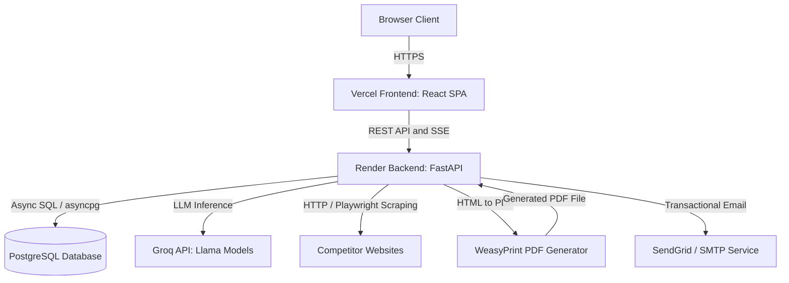
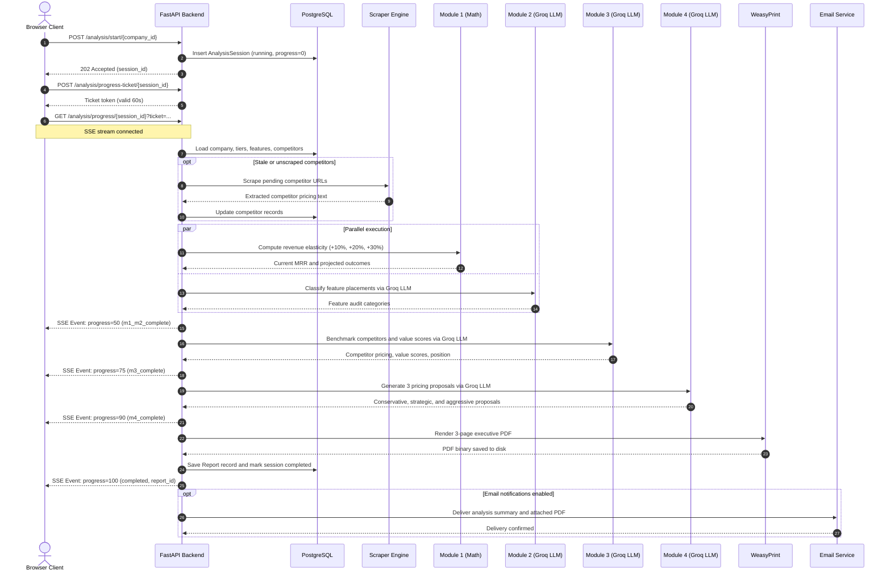

# PriceLens

PriceLens is an automated pricing sensitivity analyzer and competitor benchmarking platform for subscription businesses. A user defines a company with its pricing tiers and features, optionally adds competitor pricing URLs, and runs an analysis that models revenue changes under price increases, audits feature placement across tiers, benchmarks competitor value scores, and recommends three ranked pricing strategies. Reports can be explored interactively or downloaded as an executive three-page PDF.

- Frontend (Vercel): https://pricelens-pi.vercel.app/
- Backend API (Render): https://pricing-analyzer-8u3n.onrender.com/
- Interactive API docs: https://pricing-analyzer-8u3n.onrender.com/docs

## 1. Overview

PriceLens evaluates software packaging and pricing models to help SaaS companies find revenue expansion opportunities without increasing churn. It calculates price elasticity projections across tiers, flags misplaced features, benchmarks competitor offerings, and generates actionable restructuring proposals. The platform is designed for founders, product managers, and pricing operators seeking data-driven pricing intelligence.


## 2. Features

### Company setup
- Automated URL import: Scrapes a public pricing page and extracts company information, tiers, and features using Groq LLM extraction.
- Raw text import: Parses pasted pricing table text with LLM extraction and heuristic fallbacks.
- CSV import: Uploads pricing tiers with validation for prices, user counts, churn rates, and semicolon-separated features, including a downloadable CSV template.
- Stripe integration: Reads active subscriptions, unit prices, intervals, and 30-day cancellations via restricted API keys to auto-populate tiers and churn metrics.
- Demo company generator: One-click creation of the pre-configured "CloudHR Pro (sample)" dataset with three tiers and verified revenue numbers.
- Tier and feature management: Manual tier creation, editing, deletion, bulk feature insertion, and AI feature suggestions tailored to the company industry.
- Company cloning: Deep copies company metadata, pricing tiers, and competitor targets for scenario modeling.

### Competitors
- Web scraping: Scrapes competitor pricing pages via static HTTP requests or headless Playwright Chromium for JavaScript-rendered SPAs.
- Content cleaning: Removes footers, navigation headers, cookie banners, and scripts, keeping text with pricing signals up to an 8,000 character limit.
- Manual text fallback: Allows manual entry and editing of raw competitor pricing text when pages block automated scraping.
- Stale data detection: Automatically marks competitor scrapes older than seven days as stale and refreshes them before analysis execution.
- Competitor suggestions: Proposes direct competitors with verified pricing URLs using Groq LLM or a curated industry directory.

### Analysis modules
- Module 1 (Revenue impact): Pure Python mathematical modeling calculating current Monthly Recurring Revenue (MRR) and projecting revenue and subscriber changes at +10%, +20%, and +30% price increases using industry-specific elasticity values.
- Module 2 (Feature audit): Groq LLM categorizes all tier features into gatekeeper (premium feature priced too low), blocker (basic feature locked behind high tier), right placed (correct tier), and undifferentiated (no upgrade incentive).
- Module 3 (Competitor benchmark): Groq LLM parses competitor tiers and prices, calculates value scores (price per feature), compares feature coverage, and identifies market positioning.
- Module 4 (Pricing strategies): Groq LLM synthesizes all prior modules into three complete pricing strategies: conservative (low risk, small increase), strategic (repackaging and market alignment), and aggressive (high revenue upside).

### Reports
- Real-time progress: Streams analysis execution status (0% to 100%) to the frontend via Server-Sent Events (SSE) using short-lived progress tickets.
- Interactive dashboard: Displays KPI cards, elasticity tables, feature audit tags, competitor value score charts, and expandable strategy cards.
- Executive PDF: Compiles an executive three-page report styled with dark layout tokens using WeasyPrint and Jinja2 templates.
- Email delivery: Sends completed reports and attached PDFs to the user via SendGrid or SMTP fallback.
- Run history: Stores past analysis sessions with statuses, timestamps, MRR snapshots, and direct links to historical reports.

### Account
- JWT authentication: Bearer token authorization using python-jose and configurable expiration hours.
- Password security: bcrypt password hashing via passlib and constant-time password verification.
- Password recovery: Secure one-hour password reset tokens delivered via transactional email.
- Account protection: Brute-force lockout locking an email address for 15 minutes after 5 consecutive failed login attempts.
- Data privacy: Self-service account deletion cascading to all user companies, tiers, competitors, sessions, and reports.

## 3. System Architecture

### End to end system architecture



### Analysis pipeline sequence



### Component responsibilities

| Component | Responsibility |
| --- | --- |
| Vercel Frontend | Single-page React interface for onboarding, competitor setup, interactive dashboards, and SSE progress tracking. |
| FastAPI Backend | Asynchronous API handling routing, input validation, rate limiting, background orchestration, and SSE generation. |
| PostgreSQL | Relational database holding user credentials, company models, tiers, scraped text, sessions, and report payloads. |
| Groq API | Fast LLM inference executing feature classification (M2), competitor parsing (M3), and strategy generation (M4). |
| Web Scraper | Multi-layer scraping utility using requests and headless Playwright Chromium to extract public pricing data. |
| WeasyPrint | Server-side document engine transforming HTML and CSS templates into an executive three-page PDF. |
| SendGrid / SMTP | Email delivery service dispatching password reset links and completed pricing analysis PDF files. |

## 4. Tech Stack

| Layer | Technology |
| --- | --- |
| Frontend | React 19, Vite 8, React Router DOM 7, Axios, Lucide React |
| Backend | Python 3.11, FastAPI 0.111, SQLAlchemy 2.0 (asyncio), asyncpg 0.29, Pydantic 2, Alembic 1.13 |
| Database | PostgreSQL 16 |
| AI Inference | Groq Python SDK 1.5 (Llama 3 models via engine/groq_utils.py) |
| Web Scraping | Requests, BeautifulSoup4, Playwright Chromium 1.44 |
| PDF Generation | WeasyPrint 52.5, Jinja2 3.1 |
| Email Service | SendGrid 6.11, Python smtplib / email |
| Rate Limiting | SlowAPI 0.1.10 (limits on IP and user ID) |
| Hosting | Render (Backend Web Service), Vercel (Frontend Static SPA) |

## 5. Project Structure

```text
pricing-analyzer/
├── backend/
│   ├── alembic/                 # Database migration scripts and environment config
│   ├── engine/                  # Core pricing analysis intelligence pipeline
│   │   ├── groq_utils.py        # Groq client wrapper with retries and JSON fallback
│   │   ├── module1_revenue.py   # Pure Python elasticity and MRR projection math
│   │   ├── module2_features.py  # Groq LLM feature tier placement audit
│   │   ├── module3_benchmark.py # Groq LLM competitor value score benchmarking
│   │   └── module4_recommendations.py # Groq LLM pricing strategy proposal generator
│   ├── routers/                 # FastAPI router endpoints
│   │   ├── analysis.py          # Session kickoff, SSE progress streaming, and reports
│   │   ├── auth.py              # User signup, login, password resets, and account deletion
│   │   ├── companies.py         # Company, tier, feature CRUD, bulk actions, and cloning
│   │   ├── competitors.py       # Competitor URL scraping, manual text, and suggestions
│   │   └── setup.py             # Magic URL setup, pasted text, CSV, Stripe, and demo company
│   ├── build.sh                 # Render build script for system packages and Playwright
│   ├── database.py              # Async SQLAlchemy engine and session dependency
│   ├── email_service.py         # SendGrid and SMTP email delivery templates
│   ├── models.py                # SQLAlchemy ORM models for all relational tables
│   ├── pdf_generator.py         # WeasyPrint executive 3-page PDF template and compiler
│   ├── rate_limiter.py          # SlowAPI rate limiting rules and brute-force lockout
│   ├── requirements.txt         # Pinned Python package dependencies
│   ├── schemas.py               # Pydantic request and response schemas
│   ├── scraper.py               # Two-layer web scraper (requests and Playwright)
│   ├── url_safety.py            # SSRF validation, DNS verification, and private IP blocking
│   └── main.py                  # FastAPI application entrypoint, CORS, and lifespan handler
├── frontend/
│   ├── src/
│   │   ├── api/                 # Axios HTTP client, interceptors, and API service calls
│   │   ├── components/          # Reusable UI elements (modals, badges, navigation bars)
│   │   ├── context/             # React authentication and session state provider
│   │   ├── pages/               # Application route views (Login, Setup, Dashboard, Report)
│   │   ├── styles/              # Global variables, component CSS, and layout tokens
│   │   ├── App.jsx              # Application router definition and route guards
│   │   └── main.jsx             # React DOM root entrypoint
│   ├── package.json             # Frontend dependencies and build scripts
│   ├── vercel.json              # Vercel deployment rewrite rules for SPA routing
│   └── vite.config.js           # Vite build tool configuration
└── docker-compose.yml           # Local PostgreSQL service definition
```

## 6. Getting Started

### Prerequisites
- Python 3.11 or newer
- Node.js 18 or newer and npm
- A running PostgreSQL database instance
- System dependencies for WeasyPrint (on Linux: `libpango-1.0-0`, `libcairo2`, `libgdk-pixbuf2.0-0`, `libffi-dev`; on Windows: GTK3 runtime installer)

### Backend setup

1. Navigate to the backend directory:
   ```bash
   cd backend
   ```

2. Create and activate a Python virtual environment:
   ```bash
   python -m venv venv
   # On Linux/macOS:
   source venv/bin/activate
   # On Windows:
   venv\Scripts\activate
   ```

3. Install required Python packages:
   ```bash
   pip install -r requirements.txt
   ```

4. Install the Chromium browser binary for Playwright scraping:
   ```bash
   playwright install chromium
   ```

5. Configure environment variables:
   ```bash
   cp .env.example .env
   ```
   Edit `.env` with your PostgreSQL database URL, a 32-character JWT secret, and your Groq API key.

6. Apply database migrations:
   ```bash
   alembic upgrade head
   ```

7. Start the backend development server:
   ```bash
   uvicorn main:app --reload --port 8000
   ```
   The API will be available at `http://localhost:8000` with interactive docs at `http://localhost:8000/docs`.

### Frontend setup

1. Navigate to the frontend directory:
   ```bash
   cd ../frontend
   ```

2. Install JavaScript dependencies:
   ```bash
   npm install
   ```

3. Configure environment variables:
   ```bash
   cp .env.example .env
   ```
   Verify that `VITE_API_URL` is set to `http://localhost:8000`.

4. Start the frontend development server:
   ```bash
   npm run dev
   ```
   Open `http://localhost:5173` in your browser.

## 7. Environment Variables

### Backend environment variables (.env)

Reference file: `backend/.env.example`

| Variable | Purpose |
| --- | --- |
| `DATABASE_URL` | PostgreSQL connection string using the asyncpg driver (postgresql+asyncpg://...). |
| `JWT_SECRET` | Secret key used for signing authentication tokens (minimum 32 characters required). |
| `JWT_ALGORITHM` | Algorithm used for token generation (defaults to HS256). |
| `JWT_EXPIRE_HOURS` | Expiration lifespan of issued JWT access tokens in hours (defaults to 24). |
| `GROQ_API_KEY` | API authentication key for Groq LLM inference in analysis modules 2, 3, and 4. |
| `FRONTEND_URL` | URL of the frontend web application used for links in emails and CORS headers. |
| `CORS_ORIGINS` | Comma-separated list of allowed HTTP origins permitted to call the API. |
| `FROM_EMAIL` | Sender email address appearing on transactional messages and reports. |
| `SENDGRID_API_KEY` | Optional API key for SendGrid to dispatch transactional emails and PDF reports. |
| `SMTP_HOST` | Optional SMTP server hostname for fallback email delivery. |
| `SMTP_PORT` | Optional SMTP server port (typically 587 for TLS). |
| `SMTP_USER` | Optional SMTP username or email address. |
| `SMTP_PASS` | Optional SMTP password or app-specific password. |
| `ANALYSIS_TIMEOUT_SECONDS` | Maximum runtime in seconds before an analysis job times out (defaults to 240). |
| `ANALYSIS_DAILY_LIMIT` | Maximum number of analysis runs allowed per user per day (defaults to 5). |
| `SETUP_IMPORT_DAILY_LIMIT` | Maximum number of magic URL or text setup imports per user per day (defaults to 20). |
| `COMPETITOR_REFRESH_DAYS` | Threshold in days before scraped competitor data is treated as stale (defaults to 7). |
| `PLAYWRIGHT_BROWSERS_PATH` | Filesystem location for cached Playwright browser binaries in deployment. |

### Frontend environment variables (.env)

Reference file: `frontend/.env.example`

| Variable | Purpose |
| --- | --- |
| `VITE_API_URL` | Base URL of the backend FastAPI server (e.g. http://localhost:8000 or production Render URL). |

## 8. API Overview

Detailed interactive schemas, query parameters, and test forms are available at https://pricing-analyzer-8u3n.onrender.com/docs.

### Authentication (`/auth`)

| Method | Endpoint | Description |
| --- | --- | --- |
| `POST` | `/auth/signup` | Create account and return JWT access token. |
| `POST` | `/auth/login` | Validate credentials and return JWT access token. |
| `GET` | `/auth/me` | Fetch authenticated user profile. |
| `POST` | `/auth/forgot-password` | Send password reset token to email. |
| `POST` | `/auth/reset-password` | Validate reset token and update password. |
| `DELETE` | `/auth/account` | Permanently delete account and all data. |

### Companies and tiers (`/companies`)

| Method | Endpoint | Description |
| --- | --- | --- |
| `GET` | `/companies` | List all companies owned by user. |
| `POST` | `/companies` | Create a new company. |
| `GET` | `/companies/{id}` | Get company with tiers, features, and competitors. |
| `PUT` | `/companies/{id}` | Update company name, industry, or description. |
| `DELETE` | `/companies/{id}` | Delete company and all associated records. |
| `POST` | `/companies/{id}/duplicate` | Clone company with tiers, features, and competitors. |
| `POST` | `/companies/{id}/tiers` | Add a pricing tier to a company. |
| `PUT` | `/companies/{id}/tiers/{tid}` | Update tier price, billing cycle, or user counts. |
| `DELETE` | `/companies/{id}/tiers/{tid}` | Remove a pricing tier. |
| `POST` | `/companies/{id}/tiers/{tid}/features` | Add a feature to a pricing tier. |
| `POST` | `/companies/{id}/tiers/{tid}/features/bulk` | Add multiple features to a tier at once. |
| `POST` | `/companies/{id}/tiers/{tid}/features/suggest` | Get AI suggestions for tier features. |
| `DELETE` | `/companies/{id}/tiers/{tid}/features/{fid}` | Delete a feature from a tier. |

### Competitors (`/companies/{id}/competitors`)

| Method | Endpoint | Description |
| --- | --- | --- |
| `GET` | `/companies/{id}/competitors` | List competitors added to a company. |
| `POST` | `/companies/{id}/competitors` | Add competitor URL and start scrape. |
| `PATCH` | `/companies/{id}/competitors/{comp_id}/manual` | Update competitor with pasted pricing text. |
| `POST` | `/companies/{id}/competitors/{comp_id}/refresh` | Trigger re-scrape of single competitor. |
| `POST` | `/companies/{id}/competitors/suggest` | Suggest competitors for company industry. |
| `DELETE` | `/companies/{id}/competitors/{comp_id}` | Remove competitor from company. |

### Setup and import (`/setup`)

| Method | Endpoint | Description |
| --- | --- | --- |
| `POST` | `/setup/import-from-url` | Scrape pricing URL and extract draft tiers via AI. |
| `POST` | `/setup/import-from-text` | Parse raw text and extract draft tiers via AI. |
| `GET` | `/setup/csv-template` | Download CSV template for tier imports. |
| `POST` | `/setup/parse-csv` | Validate and parse uploaded CSV tier file. |
| `POST` | `/setup/import-from-stripe` | Extract subscriptions and pricing from Stripe API key. |
| `POST` | `/setup/sample-company` | Create or retrieve the sample CloudHR Pro company. |

### Analysis and reports (`/analysis`)

| Method | Endpoint | Description |
| --- | --- | --- |
| `POST` | `/analysis/start/{company_id}` | Initiate background pricing analysis. |
| `POST` | `/analysis/progress-ticket/{session_id}` | Generate one-time ticket for SSE connection. |
| `GET` | `/analysis/progress/{session_id}` | Stream real-time analysis progress via SSE. |
| `GET` | `/analysis/report/{session_id}` | Retrieve complete analysis JSON report. |
| `GET` | `/analysis/report/{session_id}/pdf` | Download executive 3-page PDF report. |
| `POST` | `/analysis/report/{session_id}/email` | Email report summary and PDF to user. |
| `GET` | `/analysis/history/{company_id}` | Retrieve past analysis sessions for company. |

### Health check

| Method | Endpoint | Description |
| --- | --- | --- |
| `GET` | `/health` | Check API status and version string. |

## 9. Deployment

### Render (Backend Web Service)
1. Create a new Web Service on Render linked to this repository.
2. Set Root Directory to `backend`.
3. Set Environment to `Python 3`.
4. Configure Build Command:
   ```bash
   ./build.sh
   ```
   `build.sh` installs required Pango and Cairo libraries for WeasyPrint, installs Python requirements, applies database migrations (`alembic upgrade head`), and installs the Playwright Chromium browser.
5. Configure Start Command:
   ```bash
   uvicorn main:app --host 0.0.0.0 --port $PORT
   ```
6. Add the environment variables listed in the backend table, including `DATABASE_URL`, `JWT_SECRET`, `GROQ_API_KEY`, and `FRONTEND_URL`.

### Vercel (Frontend Static Application)
1. Create a new project on Vercel importing this repository.
2. Set Root Directory to `frontend`.
3. Select `Vite` as the framework preset.
4. Set Build Command to `npm run build` and Output Directory to `dist`.
5. Add the environment variable:
   - `VITE_API_URL`: The production URL of your backend (for example: `https://pricing-analyzer-8u3n.onrender.com`).
6. Deploy the project. The included `vercel.json` ensures client-side routes redirect properly to `index.html`.

## 10. Security

- JWT authentication: Stateless Bearer authentication enforcing token validity and requiring a minimum 32-character secret key.
- Password hashing: Cryptographic bcrypt password hashing with unique salts, verified using constant-time algorithms.
- Rate limiting: Endpoint-specific limits enforced by SlowAPI across login, registration, competitor scraping, setup imports, and analysis execution.
- Brute-force lockout: Automatic 15-minute lockout on accounts that exceed five consecutive failed login attempts.
- Server-Side Request Forgery (SSRF) defense: Strict URL filtering in `url_safety.py` restricting protocols to HTTP/HTTPS, blocking internal and loopback IP spaces (including link-local and multicast ranges), enforcing maximum redirect counts of 5, and capping response payload size at 2 MB.
- CORS policy: Explicitly restricted cross-origin access configured via `CORS_ORIGINS` and regex filtering for authorized domains.
